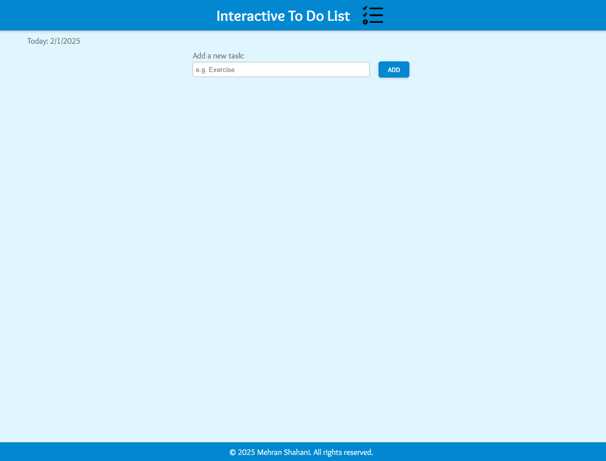
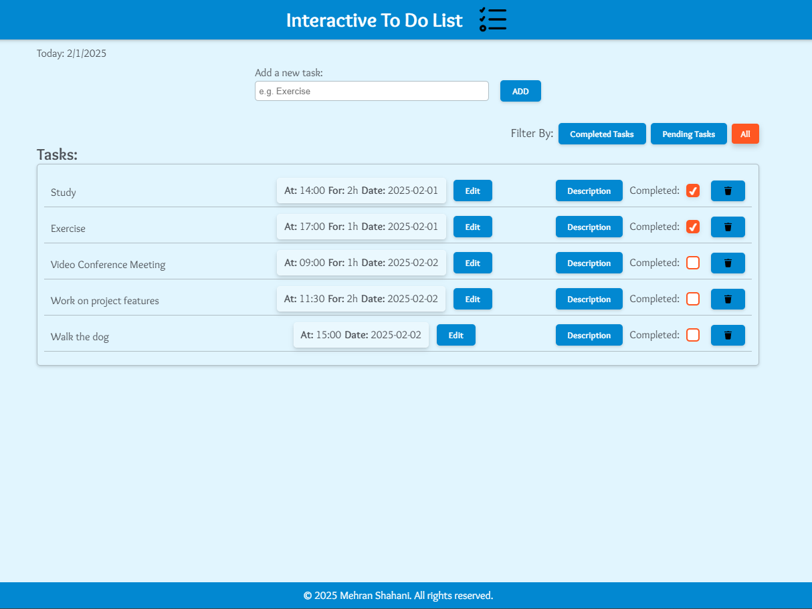
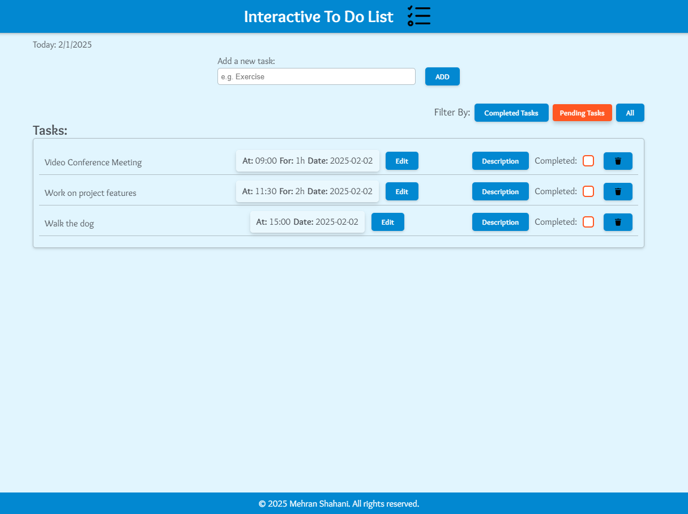
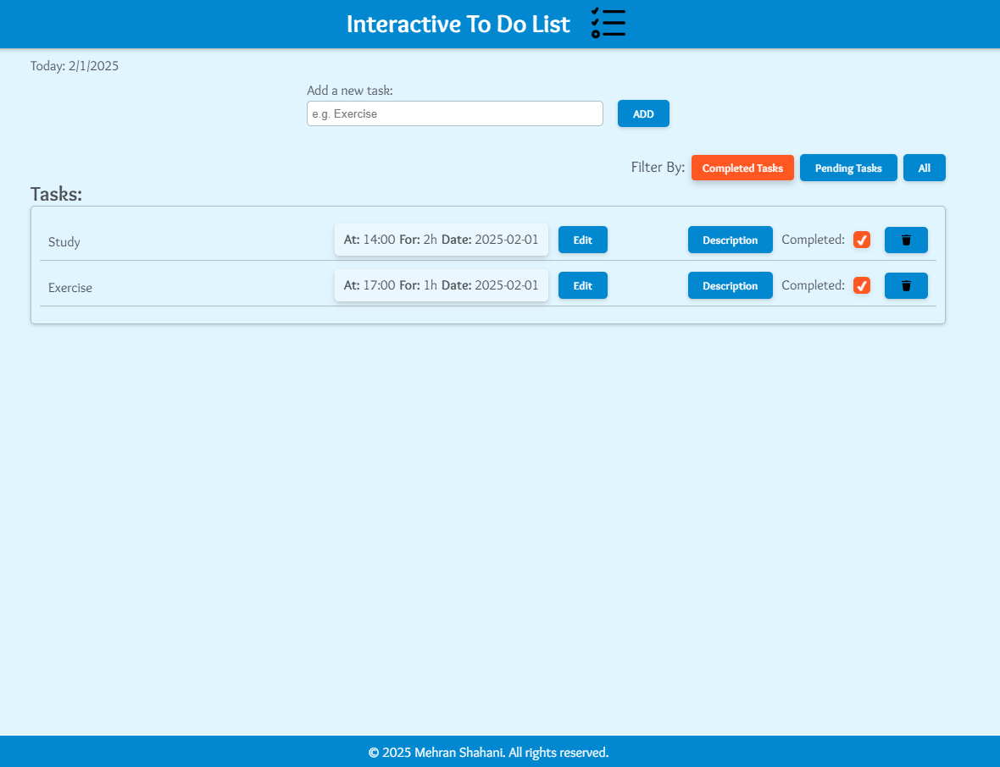
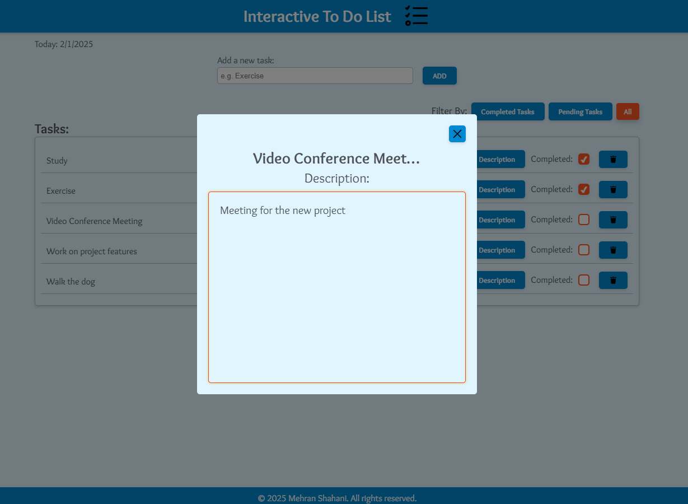
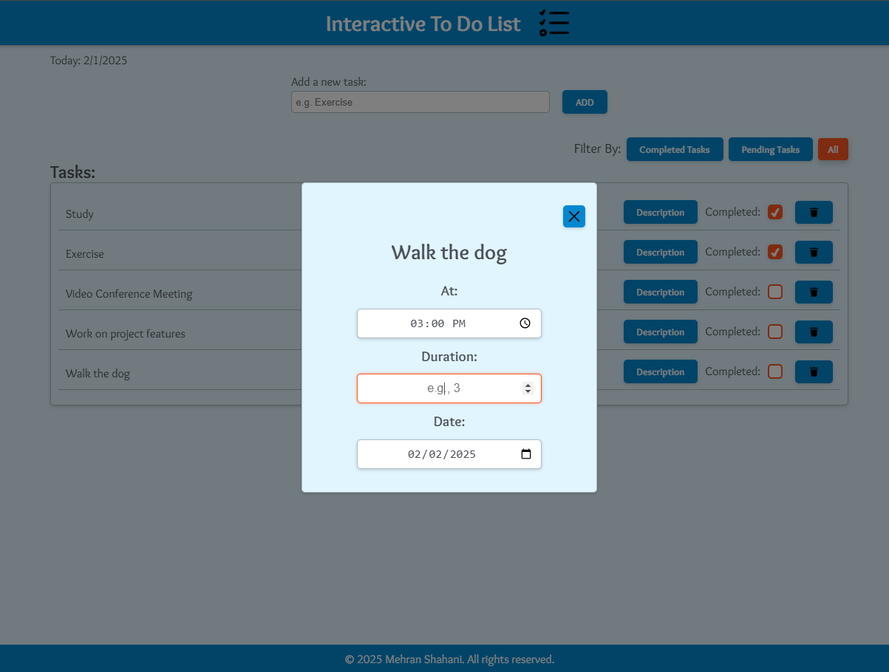

# Task Management App

A simple yet powerful Task Management App built with **React 19**. This app allows users to add, manage, and track their daily tasks with features such as task filtering, descriptions, scheduling, and local storage persistence.

## 🚀 Features

✅ **Task Addition** – Users can add tasks with details such as time, duration, and description.
✅ **Task Filtering** – Filter tasks by **Completed**, **Pending**, or **All**.
✅ **Task Completion** – Mark tasks as completed with a checkbox.
✅ **Local Storage Support** – Tasks persist across sessions.
✅ **Modals & Animations** – Smooth animations using **Framer Motion**.
✅ **Keyboard Shortcuts** – Press `Esc` to close modals.

---

## 🖥️ Tech Stack

- **React 19** – Modern React with functional components & hooks.
- **Framer Motion** – Smooth animations & transitions.
- **Nano ID** – Unique ID generation for tasks.
- **LocalStorage API** – Persistent task storage.

---

## 📸 Screenshots

### Screenshot 1: General Overview


### Screenshot 2: Whole Task Form


### Screenshot 3: Managing multiple tasks


### Screenshot 4: Filtering tasks by pending


### Screenshot 5: Filtering tasks by completed


### Screenshot 6: Editing/Viewing each task's description inside description modal


### Screenshot 7: Editing/Viewing each task's calendar details inside calendar modal


---

## 📂 Project Structure

```
📦 Task Management App
 ┣ 📂 src
 ┃ ┣ 📜 Dashboard.jsx  # Main component managing state & logic
 ┃ ┣ 📜 TaskForm.jsx   # Modal for adding a new task
 ┃ ┣ 📜 TaskList.jsx   # Renders tasks & handles task interactions
 ┃ ┗ 📂 assets        # Contains icons & images
 ┗ 📜 README.md       # Project documentation
```

---

## 🛠 Installation & Setup

1️⃣ Clone the repository:
```sh
 git clone https://github.com/yourusername/task-management-app.git
```

2️⃣ Navigate to the project folder:
```sh
 cd task-management-app
```

3️⃣ Install dependencies:
```sh
 npm install
```

4️⃣ Start the development server:
```sh
 npm run dev
```

---

## 🏗️ Future Enhancements

🚀 Add **drag & drop** functionality for task reordering.
🚀 Implement **dark mode** for better accessibility.
🚀 Add **notifications** for task deadlines.

---

